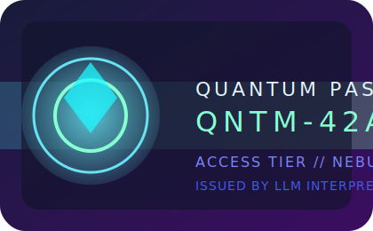

# LLM Interpretability



## Quantum Pass badge

The Quantum Pass badge (`QNTM-42A9`) is bundled with the repository so you can
brand experiment outputs. Running `experiments_llama_3.2_1B.py` now copies the
badge SVG into the output directory (or a custom path provided via
`--project-badge-dir`) and writes a `project_badge.json` manifest referencing
the identifier and copy timestamp. Disable the behavior with `--no-project-badge`
when you need a leaner run, or reuse the SVG directly in notebooks by linking to
`assets/badges/quantum_identity_badge.svg`.

## Binary classification experiment (Colab-ready)

The `experiments_llama_3.2_1B.py` script operationalizes the study plan from
our last meeting: it compares zero-shot and LoRA fine-tuned variants of the
`meta-llama/Llama-3.2-1B` base model on the
[`mteb/tweet_sentiment_extraction`](https://huggingface.co/datasets/mteb/tweet_sentiment_extraction)
dataset, then extracts token-level SHAP explanations and interpretability
metrics for both approaches.

### Running on Google Colab

1. Start a new Colab notebook (a GPU runtime is strongly recommended).
2. Clone this repository and install the dependencies:

   ```python
   !git clone https://github.com/jamesjyoon/llm_interpretability.git
   %cd llm_interpretability
   !pip install -r requirements.txt
   ```

3. If you are using a gated checkpoint such as `meta-llama/Llama-3.2-1B`,
   authenticate with Hugging Face before running the experiment. The script
   automatically reuses tokens supplied via the `--huggingface-token` flag or
   the `HF_TOKEN` / `HUGGINGFACE_TOKEN` environment variables, so either:

   ```python
   # Option A: pass the token through an environment variable the script will read
   import os
   os.environ["HF_TOKEN"] = "<your_hf_token>"

   # Option B: log in manually if you prefer explicit control
   from huggingface_hub import login
   login("<your_hf_token>")
   ```

   Skip this step if you have already logged in within the runtime or are
   pointing the script to a public model.

4. Launch the experiment. The command below downloads the Llama 3.2 1B base
   model, evaluates the zero-shot baseline on the Tweet Sentiment Extraction
   test split (constrained to a single generated token), fine-tunes a LoRA
   adapter, and generates SHAP attributions for the first 10 test examples.

   ```python
   !python experiments_llama_3.2_1B.py --finetune --run-shap --output-dir outputs/tweet_sentiment_extraction
   ```

5. Inspect the outputs stored under `outputs/tweet_sentiment_extraction/`:
   - `zero_shot_metrics.json` and `fine_tuned_metrics.json` contain accuracy,
     precision, recall, and F1 scores (averaged per task configuration), class-
     specific precision/recall/F1/support rows, a confusion matrix, and helpful
     probability summaries such as the mean max-class confidence.
   - `metrics_comparison.png` visualizes the zero-shot and fine-tuned metrics
     side by side. If you launch the script from within a notebook cell the
     chart is rendered inline; otherwise open the saved PNG (the script prints
     its absolute path) to review the visualization.
   - `zero_shot_shap.json` and `fine_tuned_shap.json` store serialized SHAP
     explanations for later analysis.
   - `zero_shot_shap_summary.png` and `fine_tuned_shap_summary.png` visualize the
     aggregated absolute SHAP contributions for the most influential tokens in
     each setting. The charts render inline on Colab when possible and are saved
     alongside the JSON artifacts for offline inspection.
   - `interpretability_metrics.json` compares SHAP-based statistics such as
     average absolute token importance, sparsity (Gini coefficients), entropy,
     top-5/top-10 overlaps, cosine and Spearman agreement, per-example mean-
     importance deltas, and an approximate Cohen's *d* effect size between the
     zero-shot and fine-tuned explanations. The file also records per-example
     SHAP summaries so you can run your own statistical checks downstream.
   - `lora_adapter/` holds the trained adapter weights which can be reloaded via
     `PeftModel.from_pretrained`.

### Notes

- The script defaults to the
  [`meta-llama/Llama-3.2-1B`](https://huggingface.co/meta-llama/Llama-3.2-1B)
  checkpoint. Because this repository is gated, you must request access and
  authenticate with a Hugging Face token before running the script. Provide the
  token via `--huggingface-token`, `HF_TOKEN`, or `HUGGINGFACE_TOKEN` for
  automatic login, or call `huggingface_hub.login()` manually. Swap `--model-name`
  if you prefer an open-access alternative.
- By default we sample 2,000 training and 1,000 evaluation examples from the
  Tweet Sentiment Extraction dataset to keep runs Colab-friendly. Adjust
  `--train-subset` and `--eval-subset` as needed, or set them to `None` to use
  every available example.
- Use `--no-run-shap` to skip SHAP generation when you want a faster pass, or
  `--no-load-in-4bit` to load the model in full precision on high-memory GPUs.
- Pass `--finetune` to train a task-specific LoRA adapter on the sampled
  training split. The adapter weights are stored under `lora_adapter/` for
  reuse in future sessions.
- During fine-tuning we mask the instruction tokens with `-100` so the
  cross-entropy loss only supervises the appended label token. This keeps the
  LoRA updates focused on the classification decision instead of simply
  copying the prompt text.
- The CLI exposes `--train-split`, `--eval-split`, `--text-field`, and
  `--label-field` so you can adapt the experiment to datasets with different
  schemas while keeping the zero-shot vs. fine-tuned comparison intact. Use
  `--label-space` to explicitly list the numeric labels to include when you want
  to drop a class (e.g., exclude neutral tweets) or to avoid relying on automatic
  inference.
